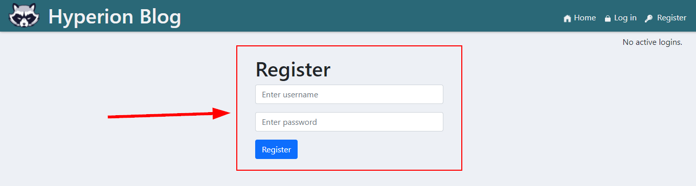
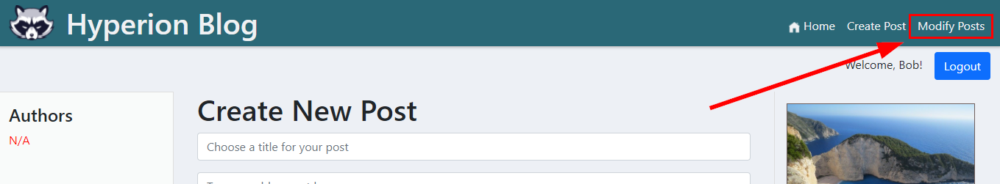
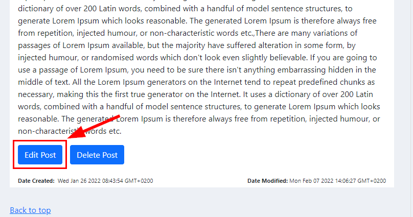
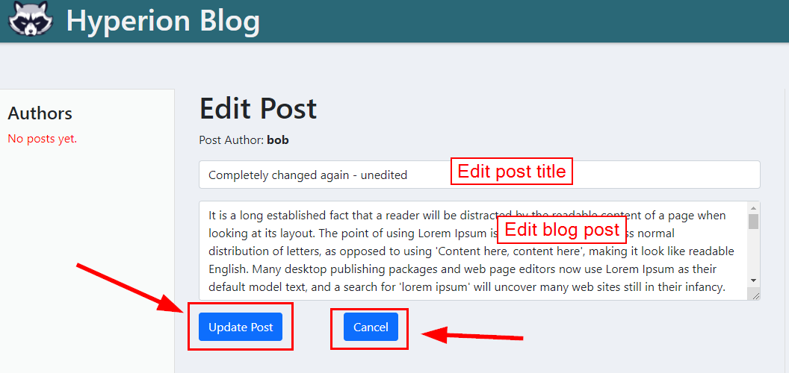
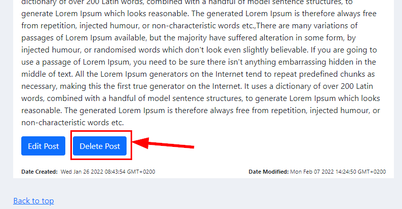

# HyperionDev Full Stack Web Development Bootcamp - Level 3 - Task 15 - Final Capstone project - Blog

## Description

This app is a simple blog that has a React front end and Express backend. It uses a MongoDb database to store the blog posts and allows the user to log in with 3 different methods (username and password, Facebook or Google). It also has an admin area that an admin can use to delete other users posts or edit them.

The app has been deployed with Heroku and can be accessed at this URL: [https://hyperionblog.herokuapp.com/](https://hyperionblog.herokuapp.com/).

## Table of Contents

- [Instructions](#instructions)
- [Technologies](#technologies)
- [Installation](#installation)
- [System Architecture](#system-architecture)
- [System Requirements Specification](#system-requirements-specification)
- [Security](#security)
- [Usage](#usage)
- [Credits](#credits)

## Instructions

These were the instructions I was given to guide me in this task:

**Follow these steps:**

- Create a full-stack web application that meets ALL the criteria listed previously for this Capstone Project.
- Deploy your app. Add the link to your deployed application to the readme.md file of your project.
- Push all the work that you have generated for this project (including the design documentation that you generated in the first part of the project) to GitHub.

## Technologies

This project uses:

- HTML
- CSS
- Javascript
- Node
- React
- React Bootstrap
- Express
- MongoDB
- JSON Web Tokens (JWT)

## Installation

To run this project, do the following:

1. Copy the project files to a directory called 'blog' on your local machine.
2. Navigate to this directory from the command line interface. E.g. cd c:/blog. This is the backend of the application.
3. In the command line interface, type 'npm install'.
4. Once it has finished installing, type 'npm start'.
5. Now navigate to the "/react-ui" directory inside "blog". E.g. cd c:/blog/react-ui.
6. In the command line interface, once again type 'npm install'.
7. Once it has finished installing, type 'npm start'.
8. You have now started both the backend and frontend servers.
9. Open [http://localhost:3000](http://localhost:3000) to view the project in your web browser.

## System Architecture

I will be creating a blog app for this task. It will be built using the MERN stack (MongoDB, Express, React and Node) with a React.js front end. I plan to use the "create react app with node server" buildpack that I found here: https://github.com/mars/heroku-cra-node to make the app easier to deploy with Heroku when it's finished (I had a lot of trouble deploying with Heroku until I discovered this buildpack). I'm using Heroku because I became very familiar with it through spending many hours troubleshooting when my previous tasks would not deploy.

I will be using React Bootstrap to aid me in styling the app attractively, since I am very familiar with using bootstrap and I think the end result looks great. I also firmly believe in using libraries such as bootstrap to make my job of coding easier and quicker. My app will have an Express backend server that will read, write, update and delete data from MongoDB using a REST api. I will use JSON Web Tokens (JWT) for authentication and the users will be able to log in using Facebook, Google or their own username and password. Users with Admin rights will be able to modify other user's blog data, while non-admin users will only be able to modify their own blog data. However, any visitor to the website will be able to view all the user's blog entries without having to log into the system.

I will make use of a modular approach when coding this app, with many separate "Components" and functions to simplify things and make the code easier to understand and maintain in the future. I will also make use of different "Routes" for the same reason.

## System Requirements Specification

### How this app will work

When a user first lands on the page, they will be able to view the blog articles that other users have created. They will be able to select which user's blogs to view by clicking on the user's name in the menu on the left side of the page. Each blog will only show part of the article, so that it doesn't take up too much space on the page. However, if the user clicks on the "Read more..." link, they will be taken to a page that allows them to read the whole article.

User's who would like to create their own blog posts will be able to click the "Register" button in the header and enter their username and password (or register with Facebook/Google). Once they have registered and logged in with their credentials, they will be able to create their first blog article. They will be able to save it, update it or delete it later on, should they choose to. All their articles will be saved to the MongoDB database, so that they remain accessable next time the user visits the website. Other web visitors will be able to view their articles, but will obviously not be able to modify them. Only an authenticated user can modify their own blog posts.

There will be one user with "Admin" rights who will be able to modify any other user's blog articles. All other users will be "non-admin" and will only be able to modify their own blogs.

### Who will use the app and why

Anyone can utilise this blog app and will be able to enjoy having the freedom to voice their opinions and experiences in the public space, while retaining anonymity, should they wish to keep their identity a secret. Of course, they are also free to use their real name as well. This blog can also serve as an online diary or journal for people who want to get their thoughts written down as a form of therapy or just a way to make sense of their experiences. Since the app saves all their articles in the cloud, it removes the need for them to consider backups, which will be very appealing to many people. Having their articles online is also superior to writing them down in a physical notebook in many cases, as some people may not want family members or friends to discover and read their private thoughts.

### Other similar websites

The 2 most popular blogging platforms on the web today are "Wix" and "Wordpress". My blog application will differ from these platforms, in that it will be much simpler and with fewer features. This is an advantage and will be a refreshing change for many users, as it will reduce the learning curve for people new to blogging. There will be no need to spend hours trying to figure out how to set up a blog, and it will also encourage older users who have very little IT experience, since they would be put off by more complex interfaces.

My blog will appeal to users who desire a clean and neat interface with minimal bells and whistles. It will do one thing (allow users to blog), but it will do that thing very well indeed. Perhaps some users will decide later on that they want more complex functionality, and they may migrate to other, more well known platforms, but this app will be a great place for anyone to start their blogging journey.

### Functional Requirements

1. Register new user with Facebook, Google or their username and password
2. Log in
3. Log out
4. Add new blog article
5. Update/edit existing blog article
6. Delete blog article
7. View existing articles from all users
8. View articles from a specific user only
9. Admin - Edit any user's blog article
10. Admin - Delete any user's blog article
11. Admin - Remove user from system

### User Stories

1. Register new user - User clicks on the "Register" button and are taken to a page that gives them the option of registering with their username and password, with Facebook or with Google. Once they have made their selection, the system encrypts their password, then saves their login details in the MongoDB database. They are then taken back the main page. A popup message appears asking them to log in with their new credentials.

2. User logs in - User types in their username and password and then clicks the "Login" button, or they click the "Login with Facebook" or "Login with Google" button. If the system does not recognise their login details, they will be shown a popup message letting them know they are not recognised and that they should either double check their login details or click the register button. When they are successfully logged in, they will see a welcome message in the header, next to a "Logout" button. They will also be able to add, edit or delete blog articles on the page.

3. User logs out - User clicks on the "Logout" button in the header section and sees a popup message that lets them know they have been logged out. They can, however, still view the articles posted by other people. The status of the system will be updated to indicate that there are no currently logged in users.

4. Add new blog article - Logged in user clicks on the "Create New Post" button and is taken to a new page. User clicks in the "Title" field and enters a title for their new blog, then clicks in the "Body" text box and types their blog post/article. Once they are finished, they can either click the "Discard" button at the bottom of their article to discard it or click on "Save" to save it. If they click the "Save" button, the user's username, the title, the article and a time stamp are saved to the Mongo database and the user sees a popup message to say "Blog article saved". They will then see the new article at the top of their list of existing articles on the page.

5. Update/edit blog article - Logged in user scrolls down list of their existing blog articles. Each article shows the date created, date modified, title and the article itself. Each article also has an "Update" button and a "Delete" button. User clicks the "Update" button for the article they would like to modify and they are taken to a page that allows them to edit the title and article body. Once they have made the changes they want, they can click the "Cancel" button at the bottom to discard their changes or click the "Update" button to save changes. When they click "Update", the MongoDB entry is updated with the new title and article body, as well as the new "modified" time stamp.

6. Delete blog article - Logged in user scrolls through their existing blogs and chooses the one they want to delete. They click on the "Delete" button for that blog article and are shown a popup message that asks if they are sure they want to delete it. If they click "Yes", they are shown another popup message to say the article was successfully deleted. The article is then removed from the Mongo database.

### Non-functional Requirements

#### Usability

1. The blog app should have a simple and intuitive user interface similar to other blog websites that user's may have seen elsewhere. I am not trying to develop something vastly different or complex here, since that will detract from the overall user experience.

2. The position and appearance of buttons, navigational links and content will conform to normal web standards that most user's should be familiar with. Effort will be made to ensure that users do not need to consult a help file to use the interface (although there will be one just in case they need it).

3. Forms will have some basic validation to make sure users can't submit blank forms or accidentally delete blog articles (i.e. they will be shown a warning message if they try to do either of these things).

4. There will be various elements on the page to ensure that users always know where they are (breadcrumbs) and whether they are logged in or logged out (message at top right of page) to reduce confusion.

5. Help will be easy to find, should users require it. Link to help file will be clearly visible in header of page.

#### Reliability

1. Error messages will be clear and helpful, rather than the usual, confusing messages.

2. As stated above, validation will reduce issues due to users entering blank form fields or accidentally deleting articles.

3. App will use MongoDB for the database. This eliminates the need to be worried about backing up blog articles, since that is all handled by MongoDB.

4. Mongo also allows for upgrades/updates to the database with no downtime to the website.

#### Performance

This app will be built using the "Create react app" starter kit created by Facebook. This not only makes it much quicker and easier for me to code my app, but improves the speed of the website by using a "virtual DOM", instead of rewriting the DOM every time a change is made to the HTML of the page.

This app will use MongoDB as a database, which is a huge advantage for performance, as there is no need for downtime when upgrading or scaling the database up. This is because Mongo uses a NoSQL database structure.

#### Implementation Requirements

1. This app should be completely web browser based.
2. It must be created using the MERN stack (MongoDB, Express, React and Node).
3. It must have a detailed help file that a user can easily find.

## Security

1. Only users that have been authenticated with a valid JSON Web Token (JWT) will be permitted to modify blog posts, and they will only ever be able to modify their own posts. Only the single Admin user will have rights to modify any user's blog articles and to remove users from the system.

2. User's passwords will be encrypted before they are stored in the Mongo database, so there will be no risk of them being intercepted in plain text while they are being sent to the database.

3. "Helmet" Express middleware will be used by the Express backend to further tighten up security. See [https://www.npmjs.com/package/helmet](https://www.npmjs.com/package/helmet) for details.

## Usage

### For Non-admin Users

1. Once you open the project in your browser [http://localhost:3000](http://localhost:3000), you will see the home page of the blog. See figure 1 below.

Figure 1

2. Scroll down the page to read any existing blog posts from other users, or click on the name of a specific blog author on the left side of the page to only see posts created by that author. See figure 2 below.

Figure 2

### Register

3. If you would like to "register" or "sign up" to create your own blog posts on the site, click the "Register" link at the top right corner of the page. See figure 3 below.

Figure 3

4. You will be taken to a page where you can choose to register in one of 3 ways (your preference):

- Choose a new username and password for yourself OR...
- Click the "Register with Google" button to register with your Google/Gmail login details OR...
- Click the "Register with Facebook" button to use your Facebook login details.

See figure 4 below.

Figure 4

5. If you choose option 2 or 3, another little window will open and ask you to enter your Google or Facebook login details, before bringing you back to the blog register page.

### Log in

6. Once you have registered, you can click on the "Login" link on the top right hand side of the page. See figure 5 below.

Figure 5

7. You can now log in with the same method you chose to register with. For example, if you chose to register with Google, you should click the "Login with Google" button to log in.

Figure 6

### Create Blog Post

8. Once you have logged in, you will be able to create your very own blog post. Simply type in an appropriate title for your post (step 1), type your actual blog post or article (step 2) and then click the "Save Post" button at the bottom when you are happy with it (step 3). See figure 7 below.

Figure 7

9. To view the post that you just created, click on the "Home" link at the top right hand side of the page and then click on your name button under "Authors" on the left side of the page. See figures 8 and 9 below.

Figure 8

Figure 9

### Edit Blog Post

### Delete Blog Post

### Log Out

To log out of the website, just click on the "Logout" button next to your name at the top right part of the page. See figure 10 below.

Figure 10

### For Admin Users

1. There is only one admin user by default. This user has the rights to edit and delete any other user's blog posts. Once the admin user has logged in (as explained in the "Log In" section above), they will see the word "(admin)" next to their username at the top right hand side of the page. See figure 11 below.

Figure 11

2. To edit or delete another user's post, first click on the "Admin Area" link at the top right of the page. See figure 12 below.

Figure 12

3. You will then see all the other user's blog posts as you could on the "Home" page. However, now you will notice that each post has an "Edit post" and a "Delete post" button underneath it. See figure 13 below.

Figure 13

4. To choose a post, either scroll down the page to the specific user's post that you would like to edit/delete, or click on the name of the user in the left hand side "Authors" section to see only that user's posts.

Figure 14

### Edit Blog Post (admin)

1. To edit a user's post, click on the "Edit Post" button at the bottom of the post you want to edit/update. You will then be able to change the title and/or the main body of the post. When you have made your changes, click on the "Update Post" button to save the changes. If you do not want to save your changes and you would rather just cancel, click the "Cancel" button. See figure 14 below.

Figure 15

### Delete Blog Post (admin)

1. To delete a user's blog post, click on the "Delete Post" button under the post you want to remove. You will be asked if you are sure. Click "Ok" to delete the post, or "Cancel" to go back without deleting it. See figure 15 below.

Figure 16

## Credits

This project was created by Evan Malherbe as part of a task for HyperioDev Full Stack Development Bootcamp - February 2022 [GitHub profile](https://github.com/evanmalherbe)
